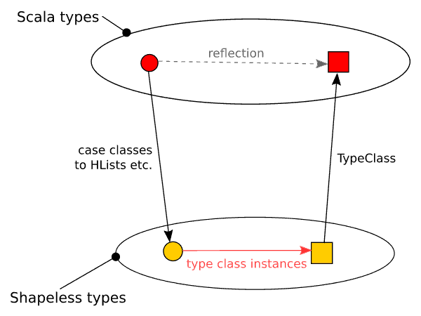

Ever wondered how you could process Scala’s case classes and sealed traits in a generic way without relying on runtime reflection? Traditionally, generic programs have been written with the help of reflection APIs. However, since reflection is usually done in runtime, it sacrifices type-safety, and introduces unnecessary lookups. Could there be a way to create generic solutions in Scala without sacrificing type-safety or efficiency?

<!--more-->

In this article, I’ll demonstrate how we can create generic solutions by taking advantage of heterogenous structures. Specifically, I’ll use the structures provided by the [Shapeless](https://github.com/milessabin/shapeless) library. For solving the problem, I only need to use HLists, Coproducts, and type class instance derivation from the Shapeless library, which I will cover in this article.

First, I’ll demonstrate a example situation where generic programming is a useful for solving the problem. After that, I’ll show how that specific example could be solved for heterogenous structures, while explaining the underlying concepts. Finally, I’ll use the solution made for the heterogenous structures to create a solution for the standard Scala types.

## The problem

Let’s assume that we’ve just inherited a Scala library that contains a large algebraic data type (ADT) consisting of immutable case classes, sealed traits, and various Scala value and collection types. The ADT doesn’t contain any open traits, so all of the possible sub types in any sub hierarchy are known at compile time.

Our task is to implement a program that calculates the depth of any object of the ADT. For the sake of simplicity, we’ll only include the case class constructor and copy constructor fields when calculating the depth of a case class. For example, a value such as `Int` is one level deep, while a `case class Coordinate(x: Int, y: Int)` is two levels deep. Similarly, the maximum depth of a collection such as Scala’s `Vector` would be the depth of its elements plus one. Depth calculation for type `Vector[(Int, String)]` is demonstrated in the picture below. The left side of the image shows the type of each level in the tree shown in the middle, while the right side shows the depth of each level.

![Depth progression for `Vector[(Int, String)]`](images/sample_depth.png)

One way to approach the problem is through type classes. We’ll create a type class for calculating the depth of an object, and add an instance of this type class for each type that exists in the ADT. Each instance relies on the type class instance of its fields to compute its own depth. The solution is similar to creating a trait for calculating the depth of an object, but type classes can be implemented over existing types without manipulating the source code. The type class for depth calculation can be defined as follows:

```scala
trait Depth[T] {
  def depth(t: T): Int
}
```

The method `depth` calculates the depth of the given object `t`. Here are a few examples instances of the type class for existing types:

```scala
implicit def stringDepth: Depth[String] = new Depth[String] {
  override def depth(t: String): Int = 1
}

implicit def intDepth: Depth[Int] = new Depth[Int] {
  override def depth(t: Int): Int = 1
}

implicit def listDepth[T](implicit elementDepth: Depth[T]): Depth[List[T]] = new Depth[List[T]] {
  override def depth(t: List[T]): Int = {
    if (t.isEmpty) 1
    else t.map(elementDepth.depth).max + 1
  }
}
```

The type class instances for value types are straightforward to implement. Value types such as strings and integers are always one level deep regardless of the value, thus the method will always return 1 in their instances. The same rule can be applied for other value types as well.

The depth instances for the list type relies on the depth instances of its type parameter `elementDepth`. In other words, the instance can only be used when its type parameter also has an instance of the depth type class in scope. The depth method uses `elementDepth` to calculate the depth for all of the list’s elements and picks the depth count that is the highest.

The same pattern can be applied for case classes and sealed traits. A type class instance for a case class depends on the type class instances of its fields to calculate its depth. Similarly, a type class instance for a sealed traits depend on the type class instances of its sub types.

The following example contains a sample ADT and the instances for calculating the depth of the ADT. It is deliberately made verbose to highlight the common pattern in processing case classes and sealed traits. A more pragmatic solution would replace the computations that obviously yield static values with the actual values.

```scala
case class Coordinate(x: Int, y: Int)

sealed trait Shape
case class Circle(radius: Int, center: Coordinate) extends Shape
case class Rectangle(corner1: Coordinate, corner2: Coordinate) extends Shape
case class Triangle(corner1: Coordinate, corner2: Coordinate, corner3: Coordinate) extends Shape

case class Surface(name: String, shape1: Shape, shape2: Shape)

implicit def coordinateDepth(implicit iDepth: Depth[Int]): Depth[Coordinate] = new Depth[Coordinate] {
  override def depth(t: Coordinate): Int = {
    iDepth.depth(t.x) max iDepth.depth(t.y)
    max + 1
  }
}

implicit def rectangleDepth(implicit coordDepth: Depth[Coordinate]): Depth[Rectangle] = new Depth[Rectangle] {
  override def depth(t: Rectangle): Int = {
    val max = coordDepth.depth(t.corner1) max coordDepth.depth(t.corner2)
    max + 1
  }
}

implicit def circleDepth(implicit iDepth: Depth[Int], coordDepth: Depth[Coordinate]): Depth[Circle] = new Depth[Circle] {
  override def depth(t: Circle): Int = {
    iDepth.depth(t.radius) max coordDepth.depth(t.center) + 1
  }
}

implicit def triangleDepth(implicit coordDepth: Depth[Coordinate]): Depth[Triangle] = new Depth[Triangle] {
  override def depth(t: Triangle): Int = {
    val max = coordDepth.depth(t.corner1) max coordDepth.depth(t.corner2) max coordDepth.depth(t.corner2)
    max + 1
  }
}

implicit def shapeDepth(implicit cdepth: Depth[Circle], rdepth: Depth[Rectangle], tdepth: Depth[Triangle]): Depth[Shape] = new Depth[Shape] {
  override def depth(t: Shape): Int = {
    t match {
      case c: Circle => cdepth.depth(c)
      case r: Rectangle => rdepth.depth(r)
      case t: Triangle => tdepth.depth(r)
    }
  }
}

implicit def surfaceDepth(implicit sdepth: Depth[String], shapeDepth: Depth[Shape]): Depth[Surface] = new Depth[Surface] {
  override def depth(t: Surface): Int = {
    val max = sdepth.depth(t.name) max shapeDepth.depth(t.shape1) max shapeDepth.depth(t.shape2)
    max + 1
  }
}
```

Writing the instances manually becomes tedious quickly. Even with just one sealed trait and five case classes, we already have over forty lines of code for the depth calculation. Since we already know the pattern for writing the instances, could we somehow express the pattern in code and derive instances for all case classes and sealed traits in order to avoid writing the boilerplate ourselves?

## From Case Classes to Products

Let’s look at alternative ways for expressing case classes and sealed traits. Our goal is to look into how they can be expressed in a more generic way. These generic expressions can then potentially be used for writing type class instances that cover all the case class and sealed traits.

Case classes in Scala have similar characteristics as tuples, i.e. they’re both combinations of multiple fields, products. Case classes can be converted to tuples by representing each field in the case class as a field in a tuple. For example, the `Surface` case class can be expressed as tuple type `(String, Shape, Shape)`. Since the number of fields varies between case classes, there needs to be a tuple type for each number of field.

We can further reduce the amount of types needed for expressing all case classes using just a tuple of two fields. The first field in the tuple contains a field from the case class while second field contains another tuple that contains more fields. For example, the `Surface` case class can be expressed as nested tuple type `(String, (Shape, (Shape, Unit)))`. The unit type is used here for terminating tuple nesting.

Shapeless contains a data type for products that’s similar to nested tuples: the heterogenous list (`HList`). The HList is essentially a list type that has type information for each of its fields. It has two sub types: the cons type, `::[+A, +T <: HList]`, and the nil type, `HNil`. The cons type consists of one field and another HList, while the nil type represents an empty HList. The `Surface` would be expressed in HList format as `::[String, ::[Shape, ::[Shape, HNil]]`, which can be expressed in the infix format as `String :: Shape :: Shape :: HNil`.

In order to define the depth type class instances that cover all the HLists, we must break the task down field by field. For example, if we can define the instance for `HNil` and `Shape`, we should be able to define an instance for `Shape :: HNil`. Using that instance, we can further define an instance for `Shape :: Shape :: HNil`, and even further an instance for `String :: Shape :: Shape :: HNil`.

By breaking down the task, the type class instance can be defined for all of the HLists with just two instances. Instead of defining an instance that can calculate the depth for all the fields, we instead define an instance that will only calculate depth of one field, and depends on another instance to be able to calculate the depth for the rest of the fields. The instance finally selects the highest of the calculated two depths.

```scala
implicit val hnilDepth: Depth[HNil] = new Depth[HNil] {
  override def depth(t: HNil): Int = 0
}

implicit def hlistConsDepth[F, R <: HList](implicit fdepth: Depth[F], rdepth: Depth[R]): Depth[F :: R] = new Depth[F :: R] {
  override def depth(t: F :: R) = {
    val head = fdepth.depth(t.head) + 1
    val tail = rdepth.depth(t.tail)
    val d = head max tail
    d
  }
}
```

The type parameter `F` represents the type of the first field in the HList, while the type parameter `R` represents the rest of the HList.

Using the implicit dependencies, the HList cons instance can reuse itself for all of the sub lists. If the HList contains more than one fields, the implicit dependency `Depth[R]` will resolve to the same HList cons instance, which will repeat the same resolution for the remainder of its own list. If there’s only one field in the list, the dependency will resolve to the HNil’s instance instead.

## From Sealed Traits to Coproducts

Scala’s sealed traits are essentially coproducts. Instead of being a combination of multiple values of different types, a sealed trait value can only be one of multiple values. The type `Either[L, R]` in Scala is a simple example of a sealed trait. It can be either of value `Left[L]` or `Right[R]` both of which contain a value.

Similar to how case classes can be expressed as nested tuples, sealed traits can be expressed as nested Eithers. By nesting the Either type, the number of different choices can be extended. For example, the `Shape` sealed trait can be expressed `Either[Circle, Either[Rectangle, Either[Triangle, Unit]]]`, where the unit type represents the end of the choices. Thus, if the choice is a `Rectangle`, then the value of the nested tuple is `Right(Left(Rectangle(...)))`.

Shapeless contains a data type for coproducts as well. The Shapeless type `Coproduct` consists of the cons type, `:+:[+H, +T <: Coproduct]`, and the nil type, `CNil`. The cons type can either be of type `Inl` or `Inr`. The `Inl` is the equivalent of the Left value in the nested Either: it’s always contains the actual choice. Similarly, the `Inr` is the equivalent of the right value in the nested Either: it contains the the rest of the coproduct. For example, the sealed trait `Shape` can be expressed as `Circle :+: Rectangle :+: Triangle :+: CNil`.

The same strategy that was used for defining the type class instances for the HList can be be applied for the coproduct case as well. It has instances for the empty case, `CNil`, and the general case that can handle just the one possible choice at a time.

```scala
implicit val cnilDepth: Depth[CNil] = new Depth[CNil] {
  override def depth(t: CNil): Int = 0
}

implicit def coproductConsDepth[L, R <: Coproduct](implicit ldepth: Depth[L], rdepth: Depth[R]): Depth[L :+: R] = new Depth[L :+: R] {
  override def depth(t: L :+: R): Int = t match {
    case Inl(l) => ldepth.depth(l)
    case Inr(r) => rdepth.depth(r)
  }
}
```

Instead of using all of the implicit dependencies, the coproduct cons instance only applies one of the two instances depending on whether the value contains a choice or not. If the coproduct contains a choice (left value), the instance `fdepth` is applied. Otherwise, the instance for the remainder of the coproduct will be used instead. The instance for the remainder is resolved to the same instance or the `CNil` instance.

## A type class for deriving type class instances

The type class instances shown earlier work for all `HLists` and `Coproducts` types, but we’d want them to work for actual case classes and sealed traits instead. Fortunately, Shapeless contains a structure, `TypeClass`, that can automatically derive the correct type class instances for all case classes and sealed traits.

```scala
object Depth extends TypeClassCompanion[Depth] {

  object typeClass extends TypeClass[Depth] {
    override def emptyProduct = new Depth[HNil] {
      override def depth(t: HNil): Int = 0
    }

    override def product[F, R <: HList](sh: Depth[F], sr: Depth[R]) = new Depth[F :: R] {
      def depth(t: F :: R) = {
        val head = sh.depth(t.head) + 1
        val tail = sr.depth(t.tail)
        head max tail
      }
    }

    override def emptyCoproduct = new Depth[CNil] {
      override def depth(t: CNil): Int = 0
    }

    override def coproduct[L, R <: Coproduct](sl: => Depth[L], sr: => Depth[R]) = new Depth[L :+: R] {
      def depth(lr: L :+: R) = lr match {
        case Inl(l) => sl.depth(l)
        case Inr(r) => sr.depth(r)
      }
    }

    override def project[F, G](instance: => Depth[G], to: F => G, from: G => F) = new Depth[F] {
      def depth(f: F) = instance.depth(to(f))
    }
  }
}
```

The depth type class instances are provided by the object `typeClass`. All of the derived instances base their implementation of depth calculation on the overridden methods provided by the object. The product and coproduct methods follow the same strategy as shown earlier.

Additionally, we also need to specify an implementation for the method `project`. It defines how we can derive a type class instance for a type in the cases where we have a type class instance for another type and a way to transform the values between the two types (an isomorphism between the types). The implementation for the method is quite simple in our case: we simply create another instance of the depth type class to take advantage of the isomorphic property.

We now have a way to calculate the depth of any case class and sealed trait. For the cases that are outside of that category (e.g. value types, traditional classes, collection types) we can specify specific type class instances for calculating the depth.

Instead of attempting to express the solution to our problem for standard Scala types directly, we modeled the solution using Shapeless’s product and coproduct types, and brought that solution back to Scala types using type class instance derivation. This process is demonstrated in the picture below.



## Conclusions

In this article, I’ve demonstrated how generic solutions can be created for ADTs without relying on an expensive runtime feature such as reflection. We gain type-safety and efficiency over reflection by leveraging the compilers ability to resolve all of the code used for the solution during compile time. This was made possible by Shapeless’s automatic type class instance derivation feature. The instance derivation relies on a particular way of representing products and coproducts, which were also covered in this article.

The style of generic programming shown in this article opens up all kinds of possibilities for writing boilerplate free code. Besides our toy example, the feature can be used for implementing pretty much any kind of generic one-way conversion. For more examples, check out how type classes can be derived for [string conversion](https://github.com/milessabin/shapeless/blob/master/examples/src/main/scala/shapeless/examples/shows.scala) and [monoids](https://github.com/milessabin/shapeless/blob/master/examples/src/main/scala/shapeless/examples/monoids.scala).

While Shapeless provides a nice, clean abstraction for generic programming over products and coproducts, it does have a few practical problems. When creating a generic solution based on type classes, you especially have to be careful on the edge cases such as Scala values and collections. If you leave out a type class instance for a type that is used in your ADT, the compiler will not tell you which specific instance is missing. It is also important to spot the special cases that might be already covered in type class instance derivation. For example, an instance can be automatically derived for the Scala `List`, but in many cases such as in our depth calculation the result of that instance will be different from what is expected.

Automatic type class instance derivation is just one of many Shapeless features. It includes many other structures for reducing boilerplate while still keeping the code type safe. One such feature is the extensible record, which allows reusing existing fields for creating new record types in an ad-hoc manner. This makes it possible to apply functions that rely on specific fields for any new records that contain those fields.
