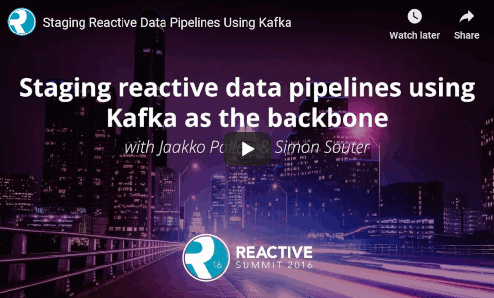

A while ago, I made a presentation on staging reactive data pipelines with [Kafka](https://kafka.apache.org/).
Here's [the video](https://www.youtube.com/watch?v=lMlspFnfHM8) and [the slides](https://speakerdeck.com/jkpl/staging-reactive-data-pipelines-using-kafka-as-the-backbone) from the talk presented at [Reactive Summit 2016](https://www.reactivesummit.org/).
I also presented the same talk at the Skills Matter conference µCon 2016.

<!--more-->

Kafka has become the de facto platform for reliable and scalable
distribution of high-volumes of data. However, as a developer, it can be
challenging to figure out the best architecture and consumption patterns
for interacting with Kafka while delivering quality of service such as
high availability and delivery guarantees. It can also be difficult to
understand the various streaming patterns and messaging topologies
available in Kafka.

In this talk, we present the patterns we've successfully employed in
production and provide the tools and guidelines for other developers to
choose the most appropriate fit for given data processing problem. The
key points for the presentation are: patterns for building reactive data
pipelines, high availability and message delivery guarantees, clustering
of application consumers, topic partition topology, offset commit
patterns, performance benchmarks, and
[custom reactive, asynchronous, non-blocking Kafka driver.](https://github.com/cakesolutions/scala-kafka-client)
