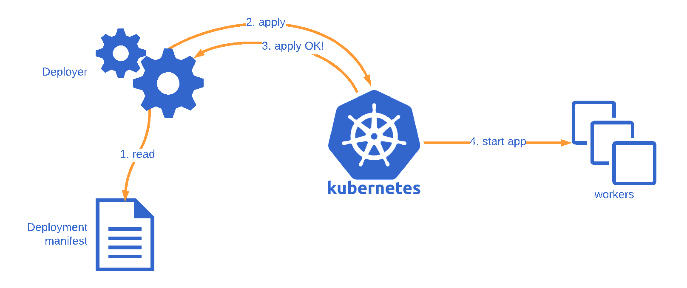
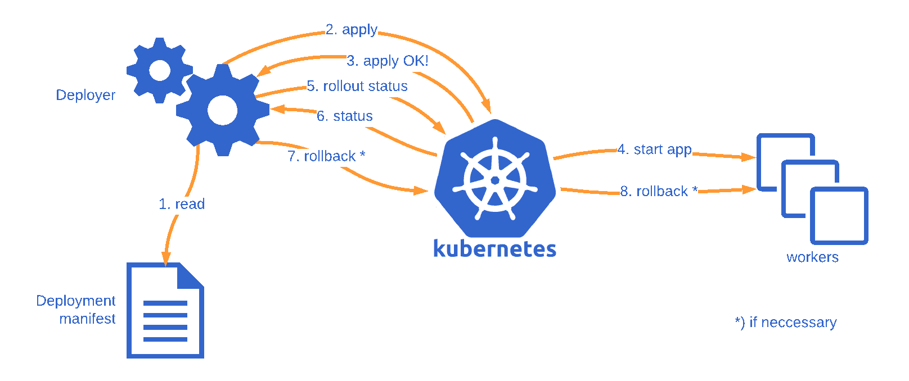

When writing and setting up software, it’s natural for us to focus on just the happy path.
After all, that’s the path that everyone wants.
Unfortunately, software can fail quite often, so we need to give the unhappy paths some attention as well.

Kubernetes is no exception here.
When deploying software to Kubernetes, it’s easy to focus on the happy path without properly checking that everything went as expected.
In this article, I’ll talk about what is typically missing when deploying applications to Kubernetes, and demonstrate how to improve it.

<!--more-->

## Typical flow for deploying applications to Kubernetes

In Kubernetes, most service style applications use [Deployments](https://kubernetes.io/docs/concepts/workloads/controllers/deployment/) to run applications on Kubernetes.
Using Deployments, you can describe how to run your application container as a Pod in Kubernetes and how many replicas of the application to run.
Kubernetes will then take care of running as many replicas as specified.

Here’s an example deployment manifest in YAML format for running three instances of a simple hello world web app:

    apiVersion: apps/v1
    kind: Deployment
    metadata:
      labels:
        app: myapp
      name: myapp
    spec:
      replicas: 3
      selector:
        matchLabels:
          app: myapp
      template:
        metadata:
          labels:
            app: myapp
        spec:
          containers:
          - image: polarsquad/hello-world-app:master
            name: hello-world
            ports:
            - containerPort: 3000

One of the key features of Deployments is how it manages application updates.
By default, updating the Deployment manifest in Kubernetes causes the application to be updated in a rolling fashion.
This way you’ll have the previous version of the deployment running while the new one is brought up.
In the Deployment manifest, you can specify how many replicas to bring up and down at once during updates.

For example, we can add a rolling update strategy to the spec section of the manifest where we bring one replica up at a time, and make sure there’s no missing healthy replicas at any point during the upgrade.

    spec:
     strategy:
       type: RollingUpdate
       rollingUpdate:
         maxUnavailable: 0
         maxSurge: 1

The update is usually performed either by [patching the manifest directly](https://kubernetes.io/docs/tasks/run-application/update-api-object-kubectl-patch/) or by [applying a full Deployment manifest from the file system](https://kubernetes.io/docs/concepts/cluster-administration/manage-deployment/).
From Kubernetes’ point of view, it makes no difference.
If the contents of the manifest update are valid, then Kubernetes will happily accept the update.
Most of the time, an application update mostly contains a change in the container image tag or some of the environment variable configurations you might have.

To automate the process, you might choose to deploy your app in your CI pipeline using kubectl.

    kubectl apply -f deployment.yaml

So now you have a pattern and a flow for getting your app to run on Kubernetes.
Everything good, right? Unfortunately, [no](https://www.youtube.com/watch?v=GM-e46xdcUo)!

It’s a great start, but it’s usually not enough.
Applying a deployment to Kubernetes finishes once Kubernetes has accepted the deployment, not when it has finished.
Kubectl apply does not verify that your application even starts.
This deployment flow is demonstrated in the picture below.

In order to properly check that the update proceeds as expected, we need assistance from another kubectl command.

## Rollout to the rescue!

This is where kubectl’s rollout command becomes handy! We can use it to check how our deployment is doing.

By default, the command waits until all of the Pods in the deployment have been started successfully.
When the deployment succeeds, the command exits with return code zero to indicate success.

    $ kubectl rollout status deployment myapp
    Waiting for deployment "myapp" rollout to finish: 0 of 3 updated replicas are available…
    Waiting for deployment "myapp" rollout to finish: 1 of 3 updated replicas are available…
    Waiting for deployment "myapp" rollout to finish: 2 of 3 updated replicas are available…
    deployment "myapp" successfully rolled out

If the deployment fails, the command exits with a non-zero return code to indicate a failure.

If you’re already using kubectl to deploy applications from CI, using rollout to verify your deployment in CI will be a breeze.
By running rollout directly after deploying changes, we can block the CI task from completing until the application deployment finishes.
We can then use the return code from rollout to either pass or fail the CI task.

So far so good, but how does Kubernetes know when an application deployment succeeds?

## Readiness probes and deadlines

In order for Kubernetes to know when an application is ready, it needs some help from the application.
Kubernetes uses [readiness probes](https://kubernetes.io/docs/tasks/configure-pod-container/configure-liveness-readiness-probes/) to examine how the application is doing.
Once an application instance starts responding to the readiness probe with a positive response, the instance is considered ready for use.

For web services, the most simple implementation is an [HTTP GET endpoint](https://kubernetes.io/docs/tasks/configure-pod-container/configure-liveness-readiness-probes/#define-a-liveness-http-request) that starts responding with a 200 OK status code when the server starts.
In our hello world app, we could consider the app healthy when the index page can be loaded.
Here’s the readiness probe configuration for our hello world app:

    readinessProbe:
      httpGet:
        path: /
        port: 3000

A more sophisticated implementation of the health check might perform some background checks to verify that everything is ready for the application to serve requests, and serve that information through a dedicated health endpoint (e.g. /health or /ready).
It’s up to the application developers to figure out when the application is ready, and how to respond back to probes.

Readiness probes tell Kubernetes when an application is ready, but not if the application will ever become ready.
If the application keeps failing, it may never respond with a positive response to Kubernetes.
How does Kubernetes then know when the deployment is going nowhere?

In our Deployment manifest, we can specify how long Kubernetes should [wait for deployment to progress until it considers the deployment to have failed](https://kubernetes.io/docs/concepts/workloads/controllers/deployment/#progress-deadline-seconds).
If the deployment doesn’t proceed until the deadline is met, Kubernetes marks the deployment status as failed, which the rollout status command will be able to pick up.

    $ kubectl rollout status deployment myapp
    Waiting for deployment "myapp" rollout to finish: 1 out of 3 new replicas have been updated…
    error: deployment "myapp" exceeded its progress deadline

What makes the deadline fantastic is that if the deployment manages to proceed within the deadline, Kubernetes will reset the deadline timer, and start waiting again.
This way you don’t have to estimate a deadline for the entire deployment, but just a single instance of the application.

For example, if we set a deadline of 30 seconds, Kubernetes will wait 30 seconds for the application to become ready.
If the application becomes ready, Kubernetes will wait another 30 seconds for the next instance to become ready.

## Scripting automated rollback

Currently, when a deployment fails in Kubernetes, the deployment process stops, but the pods from the failed deployment are kept around.
On deployment failure, your environment may contain pods from both the old and new deployments.

To get back to a stable, working state, we can use the [rollout undo](https://kubernetes.io/docs/concepts/workloads/controllers/deployment/#rolling-back-a-deployment) command to bring back the working pods and clean up the failed deployment.

    $ kubectl rollout undo deployment myapp
    deployment.extensions/myapp
    $ kubectl rollout status deployment myapp
    deployment "myapp" successfully rolled out

Awesome! Now that we have a way to determine when our deployments fail and how to revert the deployment, we can automate the deployment and rollback process with a simple shell script.

    kubectl apply -f myapp.yaml
    if ! kubectl rollout status deployment myapp; then
        kubectl rollout undo deployment myapp
        kubectl rollout status deployment myapp
        exit 1
    fi

We first rollout the changes, and then immediately wait for the rollout status.
If the rollout succeeds, we continue normally.
If it fails, we undo the deployment, wait for undo to finish, and report back a failure with exit code 1.
This flow is demonstrated in the picture below.

There is one major caveat not addressed in the script: kubectl commands may fail because of the network conditions!
The script above doesn’t account for any connection failures, which means that the script may interpret a network failure in the rollout command as a failed deployment.
Kubectl does retry retriable errors automatically, but it will fail eventually if the Kubernetes API is not available for a long period of time.

## Conclusion

In this article, I’ve talked about the typical deployment flow used with service style applications in Kubernetes, and how it’s not enough to ensure safe deployments.
I’ve presented a way to extend the deployment flow with status checks and an automated rollback procedure.

One area I haven’t covered is how the same checks and automated rollback is achieved in Helm.
Helm deployments have their own additional quirks when it comes to detecting failed deployments.
I’ll cover these quirks in another article.

I’ve published the code examples in a [GitHub Gist](https://gist.github.com/jkpl/1d6b5dfbc6660021557ad1e56029e48a).
Thanks for reading!