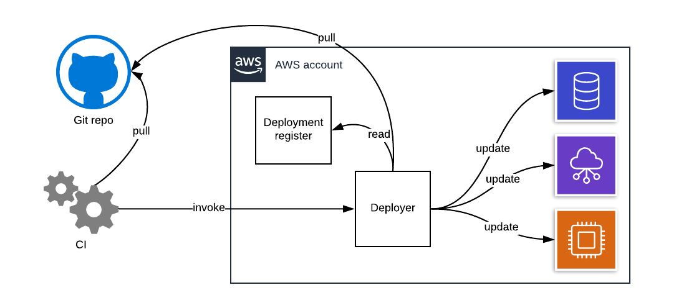
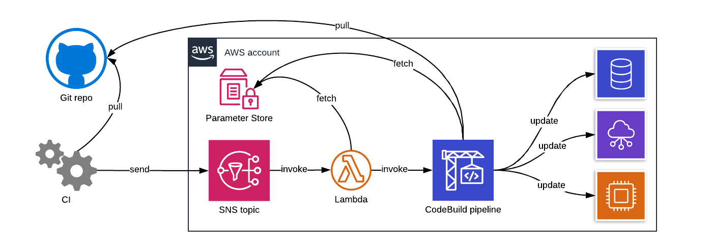

I’ve worked with a lot of clients that host their production infrastructure on AWS, but their CI pipelines are hosted by a third party provider such as Travis, Wercker, and CircleCI. It’s pretty easy to see why: the third party CIs are very easy to set up and use\! They also have pretty OK documentation, and they’re widely used in open source projects. The CI is usually used for running tests, building release artifacts, and sometimes even for deploying applications.

However, many teams feel uneasy when it comes to using the CI for deploying infrastructure changes. Usually, it’s not because they distrust an automated process to do the right thing, but because they don’t want to grant wide access to the AWS accounts that are typically required when managing infrastructure as code.

I’ve found automating infrastructure changes to be useful though. I think it reduces a lot of the cognitive load when it comes to keeping your infrastructure in sync. So, is there a way in which we could still provide continuous deployments for infrastructure changes without trusting a third party CI? In this article, I’ll present one solution to this problem. I mostly work with AWS, so I’ve built the solution for it specifically.

<!--more-->

## Constraints

We want to automate infrastructure changes, but there are constraints involved. Let’s break down the problem.

**Constraint \#1:** We don’t want to grant a third party CI access to the AWS infrastructure that would allow it to do any damage if the access were to fall into the wrong hands for any reason. For example, if the AWS credentials assigned to the CI were to leak, the attacker using those credentials shouldn’t be able to drop our databases and start spinning up crypto miners.

**Constraint \#2:** We want the infrastructure changes to be triggered without human interaction. Once the infrastructure code change is committed to the main branch on the Git repository, it’ll be eventually deployed to the production environment provided that the rest of the automation steps before it execute successfully.

**Constraint \#3:** We want the infrastructure changes to be triggered after the CI pipeline that’s attached to the same code repository. Some of the Git repositories may contain both application code and infrastructure code. For example, a Git repository might contain the source code for a web app and the infrastructure code for deploying the app and surrounding services (e.g. S3 buckets, RDS instances). In these cases, it’s important to make sure that the infrastructure changes are not run, if the tests fail in the CI pipeline.

**Constraint \#4:** We want this solution to work with multiple Git repositories. As mentioned in the above constraint, we can have infrastructure code co-located with application code, which means that we need to support infrastructure changes coming from multiple repositories.

## Rough architecture sketch

With these constraints in our minds, let’s imagine what the architecture would roughly look like.

If we want to deploy AWS infrastructure changes, but at the same time do it safely, it’s generally recommended to run them in AWS itself. This way, you only need to trust AWS instead of additional third parties. After all, you’re already trusting AWS with your infrastructure anyway. Additionally, if you deploy the changes from AWS, you can utilize IAM roles, which are much [harder to abuse than IAM users](https://docs.aws.amazon.com/IAM/latest/UserGuide/best-practices.html#use-roles-with-ec2).

Assuming that we have this magical deployer hosted in AWS, we need a way to trigger it. If we trigger it from our Git provider (e.g. GitHub webhooks) directly, we can’t guarantee that it will run after the CI pipeline has completed (constraint \#3). For this reason, we’ll expose the ability to trigger the deployer for the repository on demand from the CI (constraint \#2), but nothing more. The deployer will still be responsible for pulling the source code and any other details related to running the deployment instead of trusting the CI to pass the right information (constraint \#1).

We also need a register to contain information about which repositories specifically can be used with the deployer. When the deployer is triggered, it will verify the repository details from the register. This way we can support multiple source repositories with the same deployer (constraint \#4), but also make sure we don’t run code from arbitrary sources. We can also include information such as Git authentication details and deployment commands in the register.



## Seeking solutions

Let’s reach into our pile of LEGOs that is the [AWS product catalog](https://aws.amazon.com/products/), and see what components we can find to solve our problem.

### CodeBuild

What we’re effectively looking to do is Continuous Deployment on AWS, and [AWS’s recommendation is to use CodePipeline and CodeBuild](https://aws.amazon.com/devops/continuous-delivery/) for it. To summarize, CodePipeline is a solution for wiring up various steps to form a delivery pipeline for your code, while CodeBuild is intended to function as a step in the pipeline that runs arbitrary commands such as tests and software packaging.

Since all we want to do is run a single step, deployment of infrastructure code, CodeBuild should be enough for our purposes. CodeBuild can run Docker containers, so we can create a custom Docker image that includes all the code and tools required to pull the source repository and execute infrastructure changes. We can then execute it independently using the [StartBuild API call](https://docs.aws.amazon.com/codebuild/latest/APIReference/API_StartBuild.html).

### Proxying calls to CodeBuild

So we’ll just create a CodeBuild project, and expose the capability to call the StartBuild API from the third party CI, right? Unfortunately, that exposes too much. The StartBuild API allows you to override a lot of the details specified in the CodeBuild project including which commands to run. If the access to the API were to leak, the attacker with the access could execute arbitrary commands in our AWS infrastructure.

If only we had some sort of a proxy to bridge and filter calls from the third party CI to the CodeBuild.

I doubt that AWS has a product to specifically solve this, but we can always rely on Lambda – the 2x4 LEGO piece of AWS – to glue these pieces together. We can create an SNS topic where the CI can send a message to trigger a deployment in AWS. The SNS topic then triggers a Lambda function that launches the CodeBuild job. We can also have the Lambda function do the repo verification, and trigger the CodeBuild job only if the repo is whitelisted.

### SSM parameters

We still need a place to store details about which repositories can be used with the deployer. I’ve found SSM parameters to be a useful solution to record arbitrary, low-volume key-value pairs. It also supports IAM for access control and KMS for encrypting values, so we can limit who can modify the list of repositories whitelisted to the deployer, and safely store the Git credentials.

### Architecture diagram

Now that we’ve filled in the missing pieces, here’s what our architecture looks like.



## Show me the code\!

This wouldn’t be much of a demo if I just showed you a bunch of architecture diagrams. Let’s have a look at some code examples.

I have full the example hosted in a GitHub repository: [I Wanna Own My Pipeline in AWS](https://github.com/jkpl/iwomp-in-aws/tree/9f41681b6f2db037b5e45f897932d6069d0e2485). I built it using [AWS CDK](https://aws.amazon.com/cdk/) with [TypeScript](https://www.typescriptlang.org/) as the programming language but pretty much any infrastructure-as-code tool with AWS support would work here.

### Project info in SSM parameters

First, let’s have a look at how we store the project information to SSM parameters.

I chose to place all project information under a single root path (`/iwomp-in-aws`) with each project having a single parameter that contains all of the required details in JSON format. The JSON includes the following keys:

  - `gitUrl`: URL for the Git repository to pull code from.
  - `authToken`: Token for token-based authentication. (optional)
  - `basicUsername`: Username for basic authentication. (optional)
  - `basicPassword`: Password for basic authentication. (optional)
  - `deployDir`: Directory where all the infrastructure code is located. Default: Git root directory. (optional)
  - `command`: The command to run to deploy the infrastructure changes. Note that this same command is executed always for each run, so if you need to do any Git branch filtering, it has to be accounted for in the script.

For example, `/iwomp-in-aws/demo` could contain the following JSON document:

``` json
{
  "gitUrl": "https://github.com/jkpl/cdk-demo",
  "command": "./deploy.sh"
}
```

The project uses “demo” as the project identifier, the code is pulled from the cdk-demo repository, and the ./deploy.sh command is executed every time the deployer is triggered.

The project information can be managed manually or in an automated way. Whatever way works the best for you. [The Git repo contains an example of how to manage the projects using CDK](https://github.com/jkpl/iwomp-in-aws/blob/9f41681b6f2db037b5e45f897932d6069d0e2485/infra/lib/iwomp-projects-stack.ts).

### CodeBuild project

Since we’re going to be running a custom Docker container in CodeBuild, we’ll first set up [an ECR repository to host the Docker images](https://github.com/jkpl/iwomp-in-aws/blob/9f41681b6f2db037b5e45f897932d6069d0e2485/infra/lib/iwomp-stack.ts#L34). I’ll cover the Docker image contents in the next section.

``` typescript
import * as ecr from '@aws-cdk/aws-ecr';
const containerImageRepo = new ecr.Repository(this, 'repo', {
  repositoryName: 'iwomp-in-aws',
});
```

Now we can create [the CodeBuild project for our deployer](https://github.com/jkpl/iwomp-in-aws/blob/9f41681b6f2db037b5e45f897932d6069d0e2485/infra/lib/iwomp-stack.ts#L39). We’ll set it to read the Docker image from the ECR repository above and run the deployment command, `iwomp-in-aws`, that’s available in the image. I’ll additionally set the `CONFIGPATH` environment variable, which tells the container where we can find all the project information in SSM parameters.

``` typescript
import * as codebuild from '@aws-cdk/aws-codebuild';
const configPath = iwompProps.configPath || 'iwomp-in-aws';
const worker = new codebuild.Project(this, 'worker', {
  buildSpec: codebuild.BuildSpec.fromObject({
    version: '0.2',
    phases: {
      build: {
        commands: ['iwomp-in-aws'],
      },
    },
  }),
  description: 'iwomp-in-aws worker',
  environment: {
    buildImage: codebuild.LinuxBuildImage.fromEcrRepository(containerImageRepo),
    computeType: codebuild.ComputeType.SMALL,
    environmentVariables: {
      'CONFIGPATH': {value: configPath},
    }
  },
});
```

We’ll need to grant the CodeBuild project IAM permissions for it to function. CDK will automatically create the IAM role for the CodeBuild project that we can grant the permission for. First, we’ll need to [grant it access to read the SSM parameters](https://github.com/jkpl/iwomp-in-aws/blob/9f41681b6f2db037b5e45f897932d6069d0e2485/infra/lib/iwomp-stack.ts#L57).

``` typescript
import * as iam from '@aws-cdk/aws-iam';
const configPath = iwompProps.configPath || 'iwomp-in-aws';
const configPathArn = this.formatArn({
  service: 'ssm',
  resource: `parameter/${configPath}/*`
});
worker.addToRolePolicy(new iam.PolicyStatement({
  effect: iam.Effect.ALLOW,
  resources: [configPathArn],
  actions: ['ssm:GetParameter'],
}));
```

We’ll also want to grant access to managing other AWS services that we want to be managed automatically. [The Git repo has one example for how to do it](https://github.com/jkpl/iwomp-in-aws/blob/9f41681b6f2db037b5e45f897932d6069d0e2485/infra/lib/iwomp-stack.ts#L62).

### Deployer tool

The CodeBuild project needs a custom tool to clone the source Git repository and run the deployment command according to the information stored in SSM parameters. This is the `iwomp-in-aws` command mentioned in the last section.

I chose to code the tool using [Go](https://golang.org/) as the programming language, because I’m familiar with it, and because it produces static binaries I can just drop in any Docker image.

The launch parameters for the tool are read from environment variables using [envconfig](https://github.com/kelseyhightower/envconfig). These parameters are supplied when launching the CodeBuild job.

``` go
package main

import (
    "fmt"
    "log"
    "github.com/kelseyhightower/envconfig"
)

type appConfig struct {
    ConfigPath  string `default:"iwomp-in-aws"`
    ProjectName string `required:"true"`
    GitBranch   string `required:"true"`
}

func (c *appConfig) projectPath() string {
    return fmt.Sprintf("/%s/%s", c.ConfigPath, c.ProjectName)
}

func (c *appConfig) load() error {
    return envconfig.Process("", c)
}

func main() {
    if err := mainWithErr(); err != nil {
        log.Fatalf("iwomp-in-aws: %s", err)
    }
}

func mainWithErr() error {
    // Load app config
    var appConf appConfig
    if err := appConf.load(); err != nil {
        return err
    }
    // continued in the next code block ...
}
```

Here’s what the configurations are for:

  - `ConfigPath`: The base path for the SSM parameters.
  - `ProjectName`: Name of the project to deploy. The name should match with the project identifier in SSM parameters. For example, if this is set to `demo` and the `ConfigPath` uses the default value, the project details are pulled from the SSM parameter `/iwomp-in-aws/demo`.
  - `GitBranch`: Name of the Git branch to clone for the project.

Next, we’ll load the project configuration from SSM parameters.

``` go
import (
    "encoding/json"
    "github.com/aws/aws-sdk-go/aws"
    "github.com/aws/aws-sdk-go/aws/session"
    "github.com/aws/aws-sdk-go/service/ssm"
)

type projectConfig struct {
    GitURL        string `json:"gitUrl"`
    AuthToken     string `json:"authToken"`
    BasicUsername string `json:"basicUsername"`
    BasicPassword string `json:"basicPassword"`
    DeployDir     string `json:"deployDir"`
    Command       string `json:"command"`
}

func (c *projectConfig) load(ac *appConfig, sess *session.Session) error {
    ssmSVC := ssm.New(sess)

    projectPath := ac.projectPath()
    projectOut, err := ssmSVC.GetParameter(&ssm.GetParameterInput{
        Name:           aws.String(projectPath),
        WithDecryption: aws.Bool(true),
    })
    if err != nil {
        return fmt.Errorf("failed to fetch from SSM path %s: %s", projectPath, err)
    }
    if err := c.loadFromParameter(projectOut.Parameter); err != nil {
        return fmt.Errorf("failed to load from SSM path %s: %s", projectPath, err)
    }

    // Fill in the gaps
    if c.DeployDir == "" {
        c.DeployDir = "."
    }

    // Validate
    if c.GitURL == "" {
        return fmt.Errorf("no Git URL specified for project %s", ac.ProjectName)
    }
    if c.Command == "" {
        return fmt.Errorf("no command specified for project %s", ac.ProjectName)
    }

    return nil
}

func (c *projectConfig) loadFromParameter(parameter *ssm.Parameter) error {
    return json.Unmarshal([]byte(*parameter.Value), c)
}

func mainWithErr() error {
    // continued from the previous code block ...

    // Start AWS session
    sess, err := session.NewSession(&aws.Config{})
    if err != nil {
        return err
    }

    // Load config for the project
    var projectConf projectConfig
    if err := projectConf.load(&appConf, sess); err != nil {
        return err
    }

    // continued in the next code block ...
}
```

The project configuration includes all of the parameters listed in the “Project info in SSM parameters” section. As mentioned earlier, we’ll load a single SSM parameter, and parse its content as JSON. Some of the parameters have sensible defaults, so we’ll just go ahead and fill in the gaps if there’s any. We’ll also validate that at least the Git URL and the deployment command have been specified, and fail fast if they’re not.

With all the project information fetched, we can go ahead and clone the Git repository using [this handy Go library](https://github.com/go-git/go-git).

``` go
import (
    git "github.com/go-git/go-git/v5"
    gitPlumbing "github.com/go-git/go-git/v5/plumbing"
    gitTransport "github.com/go-git/go-git/v5/plumbing/transport"
    gitHTTP "github.com/go-git/go-git/v5/plumbing/transport/http"
)

func (c *projectConfig) gitAuth() gitTransport.AuthMethod {
    if c.AuthToken != "" {
        return &gitHTTP.TokenAuth{
            Token: c.AuthToken,
        }
    }
    if c.BasicPassword != "" {
        return &gitHTTP.BasicAuth{
            Username: c.BasicUsername,
            Password: c.BasicPassword,
        }
    }

    return nil
}

func cloneRepository(appConf *appConfig, projectConf *projectConfig) error {
    log.Printf("cloning repo %s branch %s", projectConf.GitURL, appConf.GitBranch)

    _, err := git.PlainClone(".", false, &git.CloneOptions{
        URL:           projectConf.GitURL,
        Auth:          projectConf.gitAuth(),
        ReferenceName: gitPlumbing.NewBranchReferenceName(appConf.GitBranch),
        SingleBranch:  true,
        Progress:      os.Stdout,
        Depth:         1,
    })
    return err
}

func mainWithErr() error {
    // continued from the previous code block ...   // Clone repo for the project based on app config
    if err := cloneRepository(&appConf, &projectConf); err != nil {
        return err
    }

    // continued in the next code block ...
}
```

We’ll only need the latest commit, so we can configure the clone operation to pull only the latest commit from the branch specified in the environment variables.

Finally, we can execute the deployment command specified for the project.

``` go
import (
    "os"
    "os/exec"
)

func (c *projectConfig) run(appConf *appConfig) error {
    cmd := exec.Command(c.Command, appConf.GitBranch)
    cmd.Dir = c.DeployDir
    cmd.Stdout = os.Stdout
    cmd.Stderr = os.Stderr
    return cmd.Run()
}

func mainWithErr() error {
    // continued from the previous code block ...

    // Run the project command
    return projectConf.run(&appConf)
}
```

[You can find the full source code for this tool from the Git repository](https://github.com/jkpl/iwomp-in-aws/blob/9f41681b6f2db037b5e45f897932d6069d0e2485/main.go).

### Deployer Docker image

We need [a Docker image](https://github.com/jkpl/iwomp-in-aws/blob/9f41681b6f2db037b5e45f897932d6069d0e2485/Dockerfile) to handle the deployment process. It needs to include the following:

1.  The deployer tool from the previous section.
2.  Background dependencies required to execute the actual deployment. For example, CDK, Terraform, Pulumi, or whatever tool you wish to use for managing your AWS infra.

Let’s start by building the deployer tool in build stage in Docker:

``` dockerfile
FROM golang:1.14 as builder

WORKDIR /project

# Download dependencies
COPY go.mod go.sum ./
RUN go mod download

# Build the app
COPY main.go ./
RUN CGO_ENABLED=0 go build -o iwomp-in-aws
```

With the tool built, we can prepare the Docker image for our CodeBuild project.

``` dockerfile
FROM node:14-slim

# Install system packages
RUN apt-get update && \
    apt-get install -y ca-certificates && \
    rm -rf /var/lib/apt/lists/*

# Install CDK
RUN npm install -g aws-cdk

# Non-root user
RUN groupadd -g 10101 cdk && \
    useradd -m -d /project -g cdk -u 10101 cdk
USER cdk:cdk
WORKDIR /project

# Runner script
COPY --from=builder /project/iwomp-in-aws /usr/bin/iwomp-in-aws
ENTRYPOINT [ "iwomp-in-aws" ]
```

For this demo, I’ll assume that all of the projects we want to deploy use CDK, so I’ll only install it in the image. That’s also why I use a NodeJS image as the base image. You might want to heavily customize the image to fit your own needs.

The final thing left for us to do is [to build the Docker image and push it to the ECR repo](https://github.com/jkpl/iwomp-in-aws/blob/9f41681b6f2db037b5e45f897932d6069d0e2485/bin/deploy_image.sh) we created earlier.

### The Lambda function

Next, let’s have a look at the Lambda function that’s used for triggering the deployer.

We’ll create a [JavaScript handler](https://github.com/jkpl/iwomp-in-aws/blob/9f41681b6f2db037b5e45f897932d6069d0e2485/infra/lambda/index.js) to accept SNS events. First, we’ll validate the incoming event that it contains enough information. It should contain the project identifier and the Git branch that contains the infrastructure code.

``` javascript
exports.handler = async function(event) {
    if (!event.Records[0]) {
        throw new Error('No SNS event found');
    }
    const message = parseMessage(event.Records[0].Sns.Message);
    // continued in the next code block ...
}

function parseMessage(message) {
    const json = JSON.parse(message);
    if (!json.project) {
        throw new Error('No project name provided');
    }
    if (!json.branch) {
        throw new Error('No branch provided');
    }
    return json;
}
```

Next, we’ll verify that the project is whitelisted by checking that it’s recorded in SSM parameters. The base path for the SSM parameters is provided via the `CONFIGPATH` environment variable.

``` javascript
const aws = require('aws-sdk');
const ssm = new aws.SSM();

exports.handler = async function(event) {
    // continued from the previous code block ...
    try {
        await validateProject(message.project);
    } catch (e) {
        throw new Error(`Invalid project ${message.project}: ${e.message}`);
    }
    // continued in the next code block ...
};

async function validateProject(project) {
    const ssmPath = `/${process.env.CONFIGPATH}/${project}`
    const params = {
        Name: ssmPath,
        WithDecryption: true
    };
    const parameter = await ssm.getParameter(params).promise();
    const json = JSON.parse(parameter.Parameter.Value);
    if (!json.gitUrl) {
        throw new Error('No Git URL set');
    }
}
```

Finally, we’ll launch the CodeBuild job using the event details. The Lambda will read the name of the CodeBuild job from the `WORKER_PROJECT_NAME` environment variable. We’ll pass the project name and the Git branch as environment variables to the job. The tool we created with Go will read them using envconfig as shown earlier.

``` javascript
const codebuild = new aws.CodeBuild();

exports.handler = async function(event) {
    // continued from the previous code block ...
    await launchWorkerJob(message);
    return 'ok';
};

async function launchWorkerJob(message) {
    console.log(`Triggering job for project ${message.project} on branch ${message.branch}`);
    const params = {
        projectName: process.env.WORKER_PROJECT_NAME,
        environmentVariablesOverride: [
            {
                name: 'PROJECTNAME',
                value: message.project,
            },
            {
                name: 'GITBRANCH',
                value: message.branch,
            },
        ],
    };
    const data = await codebuild.startBuild(params).promise();
    console.log(`Job started: ${data.build.id}`);
    return data;
}
```

### Deploying the Lambda function

We can [use CDK to deploy the Lambda function](https://github.com/jkpl/iwomp-in-aws/blob/9f41681b6f2db037b5e45f897932d6069d0e2485/infra/lib/iwomp-stack.ts#L67). The code is loaded from a directory named `lambda` that’s located in the same repository. Here we will pass the configuration path and the CodeBuild project name to the Lambda code as environment variables.

``` typescript
import * as lambda from '@aws-cdk/aws-lambda';
const launcher = new lambda.Function(this, 'launcher', {
  runtime: lambda.Runtime.NODEJS_12_X,
  handler: 'index.handler',
  code: lambda.Code.fromAsset(path.join(__dirname, '..', 'lambda')),
  description: "iwomp-in-aws launcher",
  environment: {
    'CONFIGPATH': configPath,
    'WORKER_PROJECT_NAME': worker.projectName,
  },
});
```

The Lambda also needs [access to launch the CodeBuild jobs and read the SSM parameters](https://github.com/jkpl/iwomp-in-aws/blob/9f41681b6f2db037b5e45f897932d6069d0e2485/infra/lib/iwomp-stack.ts#L84).

``` typescript
const configPathArn = this.formatArn({
  service: 'ssm',
  resource: `parameter/${configPath}/*`
});
launcher.addToRolePolicy(new iam.PolicyStatement({
  effect: iam.Effect.ALLOW,
  resources: [worker.projectArn],
  actions: ['codebuild:StartBuild']
}))
launcher.addToRolePolicy(new iam.PolicyStatement({
  effect: iam.Effect.ALLOW,
  resources: [configPathArn],
  actions: ['ssm:GetParameter'],
}));
```

We’ll also need an [SNS topic for incoming events](https://github.com/jkpl/iwomp-in-aws/blob/9f41681b6f2db037b5e45f897932d6069d0e2485/infra/lib/iwomp-stack.ts#L29), and have that [hooked up to the Lambda](https://github.com/jkpl/iwomp-in-aws/blob/9f41681b6f2db037b5e45f897932d6069d0e2485/infra/lib/iwomp-stack.ts#L83) we created earlier.

``` typescript
import * as sns from '@aws-cdk/aws-sns';
import * as lambdaES from '@aws-cdk/aws-lambda-event-sources';
const jobTopic = new sns.Topic(this, 'topic', {});
launcher.addEventSource(new lambdaES.SnsEventSource(jobTopic));
```

### Triggering the deployer from third party CI

We should now have our deployment pipeline setup in AWS. Now we just need to trigger it from the third party CI. We can do this by using the AWS CLI’s SNS publish command.

``` shell
aws sns publish \
  --topic-arn "$TOPIC_ARN" \
  --message "{\"project\": \"$PROJECT\", \"branch\": \"$BRANCH\"}"
```

This will publish an SNS event in JSON format that contains two fields `project` and `branch`. We need to supply three parameters:

  - `TOPIC_ARN`: The ARN for the SNS topic we created earlier.
  - `PROJECT`: The identifier for the project. E.g. `demo`
  - `BRANCH`: The Git branch where this pipeline is triggered from.

Alternatively, we can use [a script that figures out the topic ARN and the branch on it’s own](https://github.com/jkpl/iwomp-in-aws/blob/9f41681b6f2db037b5e45f897932d6069d0e2485/bin/trigger_job.sh).

## Conclusions

In this article, I explored a solution for running AWS infrastructure code changes automatically without trusting third party CI providers. I broke down the problem to four constraints and designed a solution around them. Finally, I walked through the code used for managing the solution.

This post ended up being quite a bit longer than what I initially expected. Don’t let it discourage you though\! There’s quite a bit of code to set it all up, but there’s not really any components that are running continuously. Instead, all of the components are based on AWS services that are billed based on use, which should keep the costs low when the pipeline is not in active use. Just the way I like it.

There’s of course a lot of room for extensions in the solution I presented. I didn’t cover any mechanisms for publishing feedback from the deployer. For example, the deployer could be extended to send the deployment results back to the third party CI, GitHub pull requests, or Slack. I also omitted some of the details such as SSH authentication for Git.

As mentioned in the article, [the code for the demo is available in GitHub](https://github.com/jkpl/iwomp-in-aws/tree/9f41681b6f2db037b5e45f897932d6069d0e2485). Thanks for reading!
