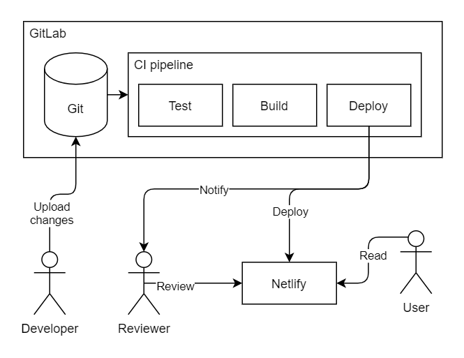
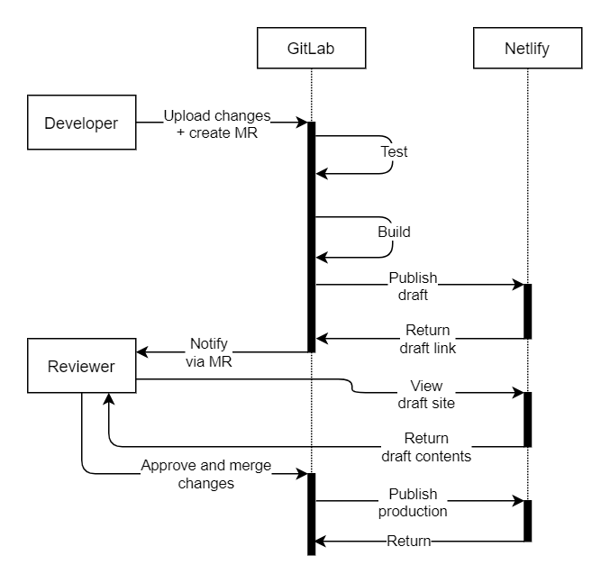

As a developer of various websites, I find [Netlify][] to be a fantastic platform for hosting static websites these days. It's straightforward to use and it provides a lot of nice integrations to development tools. For example, Netlify can attached to Git hosting platforms such as [GitHub][] and [GitLab][], where a lot of web development is coordinated these days.

One of the key features the Netlify integration provides is the ability to [preview websites from pull/merge requests](https://www.netlify.com/blog/2016/07/20/introducing-deploy-previews-in-netlify/). When a developer provides website changes for review as a pull/merge request, Netlify will automatically prepare the site and make it available for preview. This way, the people reviewing the changes can easily do so from a temporary website instead of having to manually pull the changes to their computer.

Unfortunately, the website preview feature seems to be only available when Netlify takes over the CI/CD pipeline for your website. In other words, Netlify has to build your website to offer it for preview through the integration. This can be a dealbreaker when you're already invested in a CI/CD platform such as GitHub Actions or GitLab CI. For example, I use [GitLab CI][] a lot because of its flexibility (powered by [Docker][]), and I'd prefer to keep all my pipelines there when possible.

Inspired by Netlify, I set out to marry the best of both worlds to provide website previews from GitLab CI pipelines to GitLab merge requests. In this post, I'll demonstrate how you can set up your own GitLab CI pipeline to build a static website and publish both preview and production versions of it.

[netlify]: https://www.netlify.com/
[github]: https://github.com/
[gitlab]: https://gitlab.com/
[gitlab ci]: https://docs.gitlab.com/ee/ci/
[docker]: https://www.docker.com/

<!-- more -->

## The setup

First, let's have a brief look at the overall setup we would like to have for our website hosting and development. In the setup, we have the following components:

* **GitLab** hosts the website code and assets from which we'll build our website.
* **GitLab CI pipeline** automates the testing and building of the site as well as publishing of the site changes to Netlify.
* **Netlify** hosts the website contents and assets (HTML, CSS, JavaScript, images, etc.) for both the draft (preview) and production (complete) versions of the site.

The setup has the following actors involved:

* The **Developer** uploads changes to the website code, content, and assets for review on the website's GitLab project.
* The **Reviewer** reviews the uploaded changes from the draft website and communicates with the developer on possible further changes. In most cases, the reviewer is the website owner or another developer.
* The **User** uses the actual published website and is generally not involved in the publishing process.

The components, the actors, and their relationships are visible in the architecture diagram below.



From the website development perspective, there are three main flows: The creation of the draft website when a developer uploads changes, the approval process the reviewer goes through, and the publishing of the changes. Here's how they work in this setup.

When a developer uploads changes, they'll make the changes available for review as a [merge request][] (MR). Once the merge request has been created, a GitLab CI pipeline tests and builds the website and publishes it as a draft website in Netlify. Finally, the pipeline posts the draft website link to the merge request as a comment.

When a new merge request is created, the reviewer is asked to review the changes. From the merge request, the reviewer can inspect all the code and asset changes. From the draft link, the reviewer can inspect what the website would look like after applying the changes. The approval is done by either adding an approval mark to the merge request or by merging the merge request directly. The reviewer can also reject the changes and ask for the developer to add further changes on top of the merge request.

Once the merge request has been merged, the GitLab CI pipeline will again build the website and publish the changes to Netlify. This time, instead of creating a draft website, the changes will be made visible to the end-users.

All of these flows are visualized in the flow diagram below.



In this guide, we'll be using a very simplified setup for building the website. Normally, you would use a full-blown [static website generator](https://jamstack.org/generators/) to build the website. The test phase could check that the content is laid out in proper format, the client-side JavaScript does what it's supposed to, and that the links point to proper locations. Instead of using these, we'll be using a single Markdown file that we convert to one HTML page, and we will not have any tests at all.

With the setup made clear, we can begin implementing it.

[merge request]: https://docs.gitlab.com/ee/user/project/merge_requests/

## Accounts

To get started, we need the following accounts:

* **GitLab user account**: An account that controls the website's GitLab project. You can follow [the sign-up page](https://gitlab.com/users/sign_up) to get an account if you haven't got one already.
* **GitLab bot account**: Another GitLab account to post comments from the GitLab CI pipeline to the merge requests on our behalf. This can be also set up using the same [sign-up page](https://gitlab.com/users/sign_up).
* **Netlify account**: You can [sign up to Netlify using your GitLab user account](https://app.netlify.com/signup). You'll also need to create a new team in the process if you haven't got one already.

## Bot access token

To post comments from the bot account, a personal access token needs to be generated. [Generate a new access token](https://docs.gitlab.com/ee/user/profile/personal_access_tokens.html) with the `api` scope and no expiration date. Make sure you generate the token using the **bot account**.

Technically, the GitLab user account could be used for posting comments to the merge requests, but I wouldn't recommend doing so. This is because the `api` scope grants wide read and write access to the entire account. If the token were to accidentally leak to unwanted users, they could abuse the account access in various ways: e.g. they could delete all user GitLab projects. Therefore, the bot account is used for limiting the blast radius in case such a leak happens.

Unfortunately, this is the only known way to arrange merge request comment access in GitLab for now. Hopefully, GitLab will add the capability to post comments to the merge requests using the pipeline token in the future.

## Website space on Netlify

Next, we'll need a space in Netlify to host our website. We can create one from the [Netlify web UI](https://app.netlify.com/).

Instead of creating a new site from a Git repository, we need to manually upload a directory first. This is so that Netlify doesn't try to integrate its hooks into the project in GitLab, and that we can control the website deployment process ourselves. Here's how we can do it:

1. Create a new directory in your file browser.
2. In the directory, create a new empty file named `index.html`.
3. In the [Netlify web UI](https://app.netlify.com/), navigate to the "Sites" tab.
4. Drag the new directory you created to the area that reads "drag and drop your site output folder here".

Your website space should now be created. You can continue tuning the site settings to your liking (e.g. change the site name).

## API access to Netlify

To access our Netlify website space from GitLab CI, we'll need the following information:

1. **Site ID**: A unique identifier of our Netlify website. This is also called the API ID. It can be found from the site details section in the site settings page in the Netlify web UI. It's listed as the API ID.
2. **Personal access token**: Access token to modify the Netlify website. It can be generated in the [user application settings page in the Netlify web UI](https://app.netlify.com/user/applications) by following the wizard that appears when the "new access token" button is clicked.

Similar to the personal access tokens in GitLab, the token in Netlify has wide access as well, so you need to be careful how you handle it. Unintended access could result in, for example, your website being defaced.

## GitLab project

Next, we'll need a project in GitLab to host the source code for our website. We can create one by [following the official guide](https://docs.gitlab.com/ee/user/project/working_with_projects.html#create-a-project) using the GitLab user account. If you made your repository private, you'll need to add [the bot user as a guest member](https://docs.gitlab.com/ee/user/project/members/) as well.

We can now start uploading our source code to the GitLab project. For now, we'll use a simple Markdown page that we'll convert to HTML. Upload the following Markdown file in path `index.md` to the `master` branch.

```md
# Hello world!
```

We'll later use [Pandoc's](https://pandoc.org/#) [containers](https://github.com/pandoc/dockerfiles) to convert our `index.md` Markdown file to the `index.html` HTML file in the GitLab CI pipeline. We can also test it locally with Docker as follows:

```
$ docker run --rm -v $(pwd):/data \
    pandoc/ubuntu \
    --from markdown --to html --output index.html index.md
```

If you wish, you can also try out a full-blown [static website generator](https://jamstack.org/generators/) to generate a more complex static website.

## GitLab CI pipeline variables

Before we can create the pipeline, we'll need to add a couple of variables to the CI pipeline configuration. [The variables can be accessed from the GitLab project page](https://docs.gitlab.com/ee/ci/variables/README.html#create-a-custom-variable-in-the-ui). For all the variables we'll add, we're going to use these settings:

* **Type**: Variable
* **Environment scope**: All
* **Protect variable**: disabled (unchecked)
* **Mask variable**: enabled (checked)

Let's add the following variable values.

* GitLab bot account access token with key `GITLAB_ACCESS_TOKEN`
* Netlify personal access token with key `NETLIFY_AUTH_TOKEN`
* Netlify site ID with key `NETLIFY_SITE_ID`

## GitLab CI pipeline

 GitLab CI is used for wiring up all the components we've set up earlier. It'll build our website from the Markdown file, upload the contents to Netlify, and send a message with a draft link to the appropriate merge request. With the variables added, we can begin constructing our [GitLab CI pipeline using a YAML file](https://docs.gitlab.com/ee/ci/yaml/gitlab_ci_yaml.html). Let's create a new file named `.gitlab-ci.yml` and add the following contents to it.

```yaml
stages:
- build
- publish

workflow:
  rules:
  - if: $CI_MERGE_REQUEST_ID
  - if: $CI_COMMIT_BRANCH == "master"

variables:
  NETLIFY_DIRECTORY: public
```

Here's what each of the sections does:

* Using the `stages` section, we define two stages for our CI build steps. One for building the site and one for publishing it. These stages will be executed in sequence with the `build` executed first before the `publish`. We can select whatever names we like for the stages.
* Using the `workflow` section, we limit when the pipeline is executed. In this case, the pipeline will be executed only when there's a merge request for the changes or when the changes are made to the `master` branch (i.e. the main branch).
* Using the `variables` section, we'll provide additional configuration to the build steps we're later going to define. In this configuration, we specify the variable `NETLIFY_DIRECTORY` as `public` meaning that all of the content we want to upload to Netlify will be uploaded from the `public` directory in the pipeline.

Next, let's add a pipeline step for building the website. We can do this by adding the following contents to the end of the `.gitlab-ci.yml` YAML file.

```yaml
build-site:
  stage: build
  image:
    name: pandoc/ubuntu
    entrypoint: [""]
  before_script:
  - mkdir -p $NETLIFY_DIRECTORY
  script:
  - pandoc --from markdown --to html --output "$NETLIFY_DIRECTORY/index.html" index.md
  artifacts:
    paths:
    - $NETLIFY_DIRECTORY
```

Here's what each section above does:

* `build-site` is the name of the pipeline step. We can select whatever name we like for the step.
* We'll use the `stage` section to place the step to the `build` stage we mentioned earlier.
* We'll use the `image` section to select the container image we want to run as our pipeline step. Here we use the Pandoc container we introduced earlier. We'll also need to [override the Pandoc container's entrypoint so that GitLab can pass a custom script to the container to execute](https://docs.gitlab.com/ee/ci/docker/using_docker_images.html#overriding-the-entrypoint-of-an-image).
* In the `before_script` section, we set the environment in our pipeline step. Here we just ensure the `NETLIFY_DIRECTORY` exists as a directory in the container.
* In the `script` section, we'll execute the commands that produce our web page file `index.html`. We'll place it inside the `NETLIFY_DIRECTORY`.
* Finally, we'll use the `artifacts` section to store the `NETLIFY_DIRECTORY` in the pipeline. This way the directory and its contents are available to the next pipeline step.

The above pipeline step just builds the website and stores it in the pipeline, and we still need to upload the contents to Netlify. For that, we need to add another pipeline step. Let's add the following contents to the end of the `.gitlab-ci.yml` YAML file.

```yaml
publish-to-netlify:
  stage: publish
  image: registry.gitlab.com/lepovirta/netlify-deployer:ci
  script:
  - gitlab-deploy-site
```

In the above YAML snippet, we'll add a pipeline step to the `publish` stage and execute [a container image](https://gitlab.com/lepovirta/netlify-deployer/container_registry/) I created for [publishing sites to Netlify](https://gitlab.com/lepovirta/netlify-deployer). The step will execute one command, `gitlab-deploy-site`, that's pre-built to the container image. Pretty much all of the magic for publishing to Netlify happen within the container image. We'll take a look at it in a later section.

With the above contents added to the `.gitlab-ci.yml` file, we can upload it to the root directory of the GitLab project. After the upload, a new pipeline should and execute the steps we created. After the pipeline has finished, you should see a "Hello world" message in the Netlify site you created earlier.

## Test run

We should now have everything set up, so let's complete this guide with a test round where we create a merge request to preview website changes.

1. Create a new branch in your GitLab project
2. In the new branch, change the contents of the `index.md` file.
3. Push the changes to the branch in GitLab.
4. Create a new merge request for the branch.
5. Wait for the pipeline to complete.

After completing these steps, you should see a comment from your GitLab bot account pop up in the merge request with a link to a preview site. Clicking the link will lead you to a temporary site on Netlify that displays the changes you made. If you managed to get the preview site up, congratulations for completing this guide! To get the changes visible in the actual site, merge the merge request and wait for the pipeline to complete.

## netlify-deployer

Most of the heavy lifting in arranging the site preview on GitLab CI pipelines was done using a small project I created called [netlify-deployer](https://gitlab.com/lepovirta/netlify-deployer). What it does is not that advanced but it manages to combine most of the details in a neat little package (a container image to be more precise). Here's how it works.

The site deploy functionality is implemented using [a small Go program](https://gitlab.com/lepovirta/netlify-deployer/-/blob/938450754fd04e728b8a2b95cef1001759583040/main.go). It performs the deployment using [the official Netlify Open API client library](https://github.com/netlify/open-api) from files on a directory. The directory, the site ID, the authentication token, and the rest of the details are configured using environment variables that are picked up using [Kelsey Hightower's envconfig library](https://github.com/kelseyhightower/envconfig). The program creates a preview site when the environment variable `NETLIFY_DRAFT` is set.

The site deployment could have also been done using [Netlify's command-line interface](https://github.com/netlify/cli), but I felt it didn't fit the purpose. The first issue is that it was pretty difficult to capture the draft link from the tool output so that I could send it forward. Second, the tool depends on a high amount of libraries and tools which made it hard to keep the container image small in size. For the CLI, it makes sense to have all the dependencies it has because it does more than just deployments, but in my case, they were just in the way.

In the GitLab CI pipeline, the Go program is wrapped with a [Bash script](https://gitlab.com/lepovirta/netlify-deployer/-/blob/938450754fd04e728b8a2b95cef1001759583040/gitlab-deploy-site.sh) that figures out all the configuration details from the CI environment variables and passes them to the program. Additionally, it takes care of posting the draft link as a comment to the merge request using [curl](https://curl.se/).

The netlify-deployer tool is available as a Docker container image in the [GitLab container registry](https://gitlab.com/lepovirta/netlify-deployer/container_registry) in two variants. One of the variants just includes the Go program in a [minimal Docker image](https://gitlab.com/lepovirta/netlify-deployer/-/blob/938450754fd04e728b8a2b95cef1001759583040/Dockerfile.minimal) that's intended to be used from the command-line or automation scripts. [The second variant](https://gitlab.com/lepovirta/netlify-deployer/-/blob/938450754fd04e728b8a2b95cef1001759583040/Dockerfile.ci) includes the wrapper script and other useful tools that make it easy to use it in a GitLab CI pipeline.

## Conclusions

In this article, I presented how you can integrate Netlify website previews in your GitLab CI pipeline for your static website without handing over the CI duties to Netlify. For this task, I used my small program called [netlify-deployer](https://gitlab.com/lepovirta/netlify-deployer) to glue GitLab and Netlify together.

If you're interested in seeing a real-world example of the setup in action, check out [my website's GitLab project](https://gitlab.com/lepovirta/lepo/-/tree/36793eff36bb4181e32d81814d99bae25ccb9201). Thanks for reading!
